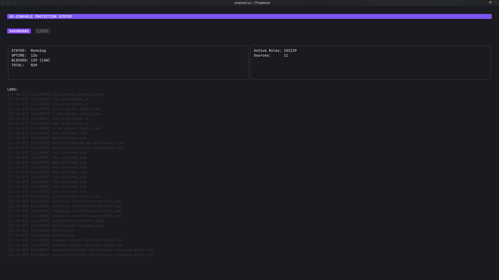

# Go-Sinkhole

**Go-Sinkhole** is a lightweight, high-performance system-wide adblocker written in Go. It functions as a local DNS sinkhole (similar to Pi-hole) but is designed to run efficiently on your local machine with a split-architecture design: a background daemon handles the traffic, while a modern TUI (Terminal User Interface) provides real-time monitoring and control.



## Features

- **System-Wide Blocking**: Acts as a DNS server to block ads and trackers across all applications.
- **Split Architecture**:
  - **Daemon**: Runs silently in the background (Systemd integrated), handling DNS requests and managing blocklists.
  - **Client (TUI)**: Connects via Unix Socket to visualize stats, view live logs, and toggle blocklists without needing `sudo`.
- **High Performance**:
  - Compiles to a single binary.
  - Asynchronous blocklist loading with zero-allocation matching logic.
  - Efficient concurrency using Go routines.
- **Robust Integration**: Safely handles Linux ports (53) and integrates with `systemd-resolved` to prevent conflicts.

## Installation

You can build and install the service automatically using the provided script.

### Prerequisites

- Go 1.21+
- Systemd (Linux)

### Quick Start

```bash
# Clone the repository
git clone https://github.com/your-username/go-sinkhole.git
cd go-sinkhole

# Install (Compiles binary, sets up Systemd service)
sudo ./install.sh
```

This will start the daemon in the background.

## Usage

### Monitoring

To monitor the system, simply run the TUI client. No root privileges are required for viewing.

```bash
sinkhole tui
```

- **Dashboard**: Real-time stats on total vs. blocked queries.
- **Logs**: Live stream of DNS activity (Allowed/Blocked domains).
- **Lists**: Press `TAB` to switch views. Toggle individual blocklist sources on/off.
- **Allowlist**: Manage a custom allowlist of domains to bypass blocking. Support for adding/removing domains directly from the TUI.

### Controlling the Service

The daemon is managed via standard systemd commands:

```bash
# Stop the adblocker
sudo systemctl stop go-sinkhole

# Restart
sudo systemctl restart go-sinkhole

# View service logs
journalctl -u go-sinkhole -f
```

## Configuration

By default, Go-Sinkhole uses the **StevenBlack Unified** host file.
Logs are stored at `/var/log/go-sinkhole.log`.

## License

MIT
